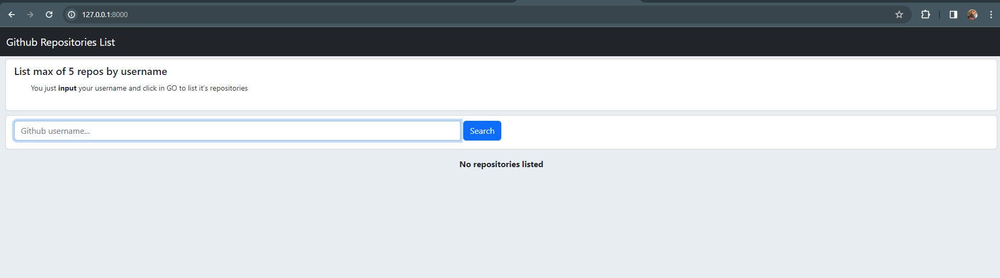
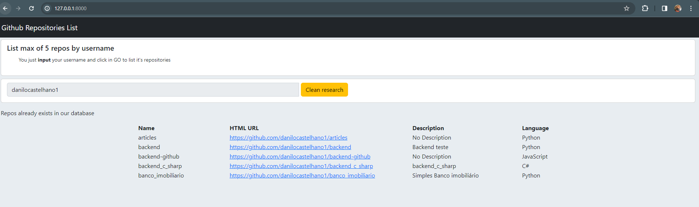

# GitHub user repos list

## Used stacks:
- Django Web (frontend and backend)
- Docker (Containerizing the web app and db) 
- Postgres (store repos data into database)

## Steps
- rename .env-example to .env
- just run ```docker-compose up --build```
Once the docker is running, you can test the web in:
```127.0.0.1:8000``` in your web browser
- I have created a username and password to access admin page:
just go to ```127.0.0.1:8000\admin``` and log with these information below
```
username = admin
password = admin
```
feel free to create another user, using ```createsuperuser``` command inside docker

## Prints to ensure the app is ok
### Web
No repos:


List a new repo:


List an existing repo in DB:


Admin page:
